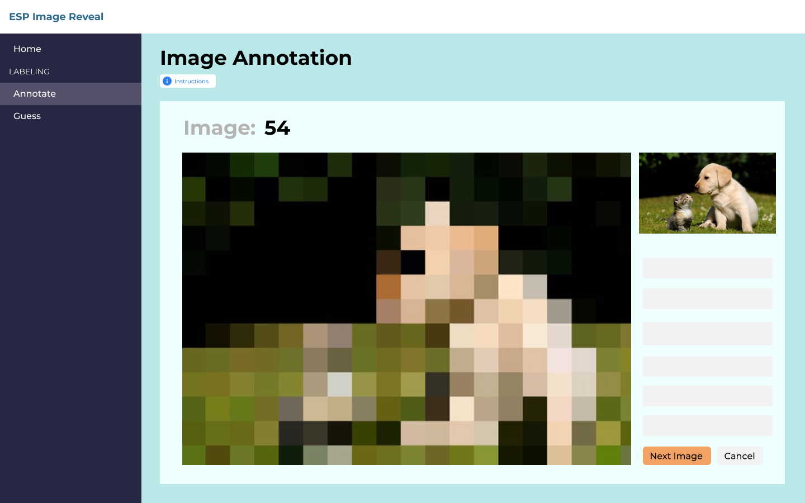
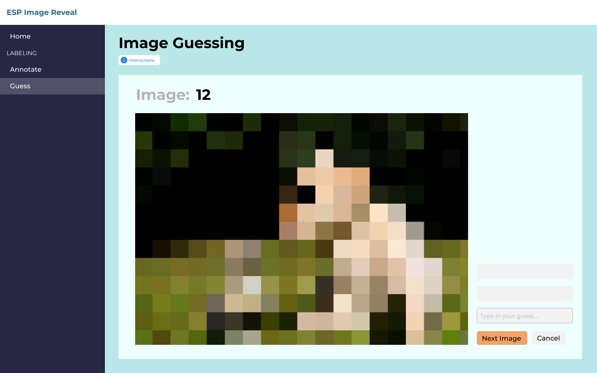

# image-reveal-game
For our NETS 213 Final project, we will be creating a game in which users deblur images in the least amount of clicks for other users to identify the subject of the image. This game's purpose is to provide meaningful insight to image recognition.

[Link to Flow-Diagram](https://raw.githubusercontent.com/kimyoonduk/image-reveal-game/main/docs/d1/flow_diagram.png)

## Milestone 2 Deliverable 1 - Major Components and Points Distribution

### Planning (1 point) 
In planning phase of our project, we expect to lay out the guidelines for Task 1 (annotation) and Task 2 (guessing), including the instructions that the user will see. We will also be selecting and inputting a relevant image dataset, setting goals for the size and attributes of our HIT's outputs, and establishing a budget and timeline for our milestones. 

### Task 1: Annotation (8 total points) 
Our first task for the crowdworkers is annotating images. To do this, a crowdworker will be given a clear version of an image, a blurred version of the same image, and a label associated with the image. For example, the label could be 'dog' and the image would be one containing a dog somewhere within it. The annotator's role is to click on pixelated squares of the blurred image to make that square clear, with the goal being to reveal the label in as few clicks as possible.

AMT HIT (4 points)
This will involve creating the interface that the users will interact with to deblur the images strategically.

Raw Data and Aggregation (2 points)
This will involve grabbing the data that we receive from the HIT and processing it in a way that is then usable for our second task.

Quality Control (2 points)
We will have to have a system of checking if the users are actually completing the task and not just selecting random squares quickly and submitting.

Mockup

### Task 2: Guessing (5 total points)
For this task, users will be given the blurred image and will have to guess what the keyword for the image was. Incrementally, we will deblur the image according to a HIT in Task 1, so that the user in Task 2 will be "responding" to the the user in Task 1's strategic deblurring. They will have a chance to guess the keyword with each square that is deblurred.

AMT HIT (2 points)
This will also involve implementing an interface where the user just needs to guess the keyword, as the picture becomes gradually deblurred, square by square.

Raw Data and Aggregation (2 points)
This will involve again pulling the data from the HIT and making it usable for the final analysis.

Quality Control (1 point)
Here we can simply check if they are making reasonable guesses and not just trying to submit the task with no intelligible inputs.

Mockup

### Analysis and Writeup (4 total points)

Data Description (2 points)
To characterize the data collected, we will create a heatmap for the click sequences that show which pixels are most commonly included for the given label to be guessed. We plan to also create visualizations for the selected coordinates and their corresponding answer rates. We also want to find characteristics of 'good' annotators and guessers, based on the time it took for themselves or their corresponding guesser to guess the label correctly.

Analysis of Results (2 points)
Analysis of our results will involve answering the big-picture questions and goals that we set for this project. We want to answer questions such as: is the most common sequence the best performing sequence? How do the guesses evolve over time? Do different incentives change the outcome, such as offering a bonus for fewer guesses? Analysis of the click sequences heatmap, coordinate and answer-rate data should give us insights to answer these questions and to better understand the process of image recognition.

## Milestone 2 Deliverable 2: Data, Processing, and File Directory

### Data
Our game is split into two parts, one where users will annotate and deblur images and one where users will guess the labels for the images. Towards that end, in our `/data` folder we have things separated by task, `t1_annotate` for annotation and `t2_guess` for guessing. For Task 1: Annotation, our input data for one task is an image, a blurred version of that image, and a label describing the object of the image. This is our **Raw Data**. Task 1's input (`/data/t1_annotate/input`) overall then will be the images and their blurred counterparts. 

A quick note on where we may get these images: we were considering to arbitrarily create a dataset, but one of the teammembers found a dataset called COCO (Common Objects in Context) with images that had annotations to them, such as what objects were in the image and crucially where that object specifically is in the image, with coordinate data for the correct boundaries of each object. You can find this at `data/metadata/meta.json`. This is also where we will be pulling the labels from. You can look at an example of where were pulling from [here](https://cocodataset.org/#explore?id=22892), and download the datasets [here](https://cocodataset.org/#download).

The output for Task 1 (`/data/t1_annotate/output`) will be the csv file that is outputted from MTurk, giving us the normal information about each HIT, but crucially the coordinates of their click, so that we know what to unblur. In the folder there is a sample csv currently there for **QC and Aggregation**, and the relevant columns are the "point_1, point_2, ..." columns for each time they click to deblur.

For Task 2: Guessing, the input (`/data/t2_guess/input`) is exactly the output for Task 1, the MTurk csv results file. This is so that we can take the coordinates of their clicks and use them to create the second task, where we incrementally deblur the image to a different user to guess the label, according to the original users click order. 

The output for Task 2 (`data/t2_guess/output`) is another MTurk csv results file, but this time the relevant data that we want to capture is the workers' guesses for the picture that will sequentially become deblurred. We have another sample csv that shows this data for **QC and Aggregation**, where different users will have a different number of guesses on what the label of the photo is (formatted right now as columns "guess_1, guess_2,...").

### QC and Aggregation
--Note-- In our most up to date iteration of QC and Aggregation, see our note at the bottom of the README --Note--

You may have noticed that the csv outputs in the `/data/t1_annotate/output` folder and the `/data/t2_guess/output` folder both have filtered versions of the csv as well. This is part of our Quality Control module, where we decide if there are inputs that we want to reject. For this code, you can look at the `src/data_processing.py` but the working version is in a jupyter notebook here: `notebook/data_processing.ipynb` At the bottom, the last two cells are marked "Task 1 Quality Control and Aggregation" and "Task 2 Quality Control and Aggregation"

Task 1 Quality Control and Aggregation looks through each of the users' clicks when annotating the image, and filters out the users whose average selected point was above the 75th or below the 25th percentile of all selected point locations for the given label. Depending on the dataset of images we pull from (the metadata folder we discussed earlier), we also most likely will be able to get already-annotated images (say, a picture of a cat with the coordinate labels associated with the cat) so that we can compare that with user clicks. We want to filter out users who make wild guesses which have nothing to do wtih the label. Task 2's Quality Control and Aggregation looks through each of the Worker's guesses and uses a majority vote to create the final gold standard guess. It then goes through and removes the HITs where the user doesn't get the majority guess. This is to remove users who may submit answers that aren't words or are generally unintelligible.

## Milestone 3: Instructions for Contribution and Code Description

### Step-by-Step Instructions
1. The following link provides access to our Task 1 (Annotation) and Task 2 (Guessing): https://image-reveal-game.netlify.app/
2. If you encounter any problems when completing our tasks or if you have any questions, you can contact us at jhoop@seas.upenn.edu
#### Instructions for Annotation Task
3. After navigating to the above link, open the "Go to task 1 - Annotation" link. You should see an **Image Revealing Task** Screen that includes basic instructions for completing the task, along with a bolded image label and two versions of an image (one blurred).
4. To complete this task, imagine that you are playing a game with a friend with the goal being to help your friend identify the given label in the image in as few guesses as possible. Your friend will have access to the blurred image and any pixels you reveal in it, but will not have access to the label. Using the clear image as a reference, you should click on the pixelated boxes in the blurred image that you think best reveal the label. But choose your clicks wisely as you will only be able to make up to 10 clicks. After each of your clicks, your friend will be able to see what was revealed in the blurred image and guess what the label is. If at any point you feel your clicks accurately reveal the label you may press the **Done** button to complete the task.
#### Instructions for Guessing Task
5. If you have already completed the Annotation Task, you can navigate back to the home page using the **Back to Main** link at the top of the screen. 
6. First open, "Go to task 2 - Guessing" link. You should see an **Image Guessing Task** Screen that includes basic instructions for completing the task, along with a blurred image and a guessing box. 
7. To complete this task, imagine that you are playing a game with the goal being to identify the object in the blurred image in as few guesses as possible. More parts of the image will be revealed to you after each of your guesses. But choose your guesses wisely as you will only be able to make up to 10 guesses. To make a guess, enter your guess into the "your guess" textbox and click **Submit Guess**. Once you have used up all of your 10 guesses or you think that you have successfully guessed the object, the task is complete.

### Updates on QC and Aggregation
--Note-- In our most up to date iteration of QC and Aggregation, see our note at the bottom of the README --Note--

For Quality Control, we created a script in `src/data_processing.py` which when run computes quality control on both Task 1 and Task 2. For Task 1, it calculates the bounding box from the meta.json file from COCO, and checks to see whether the user clicks are within that bounding box. It then calculates worker quality of how many clicks were within the bounding box vs. the total number of clicks. It outputs this as a csv of (workerID, quality). For Task 2, it simply outputs workers whose guess is ultimately incorrect. We could further implement this to create a similar sort of quality check as to how many they were able to guess correctly, but for now it outputs the workerIDs of workers who got at least one guess incorrect as a csv. 

For Aggregation, we have a sample notebook in `notebook/data aggregation.ipynb` where we visually plot for each image its bounding box, and all of the user inputted clicks that we collected. What's there currently is the example that is used with our sample output data. This is just one way that we could be able to aggregate the data for the Task 1: Guessing part of our project. For Task 2, there could be simpler graphs that represent the different guesses for each image.

### Final Update on QC and Aggregation
Our most up to date notebooks on QC and Aggregation are split by task in the `notebook` folder. `notebook/task1-aggregation.ipynb`, `notebook/task1-quality-control`, `notebook/task2-aggregation.ipynb`, `notebook/task2-quality-control` are the final notebooks for QC and Aggregation, and are the ones used in the final report. The csvs created by the QC notebooks can be found at the `quality` folder, and the images outputted by the Aggregation notebooks can be found at the `aggregation` folder.
